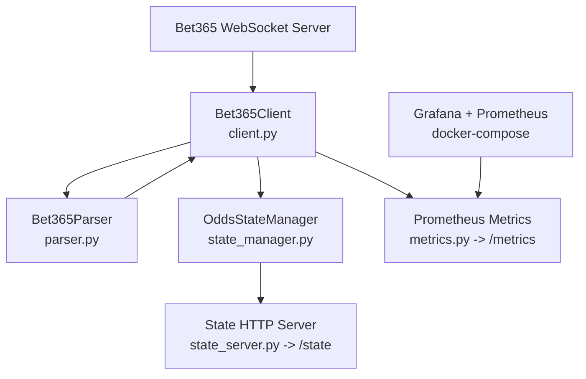

# Bet365 Odds Websocket Delta Parser

A Python script that connects to Bet365's live odds WebSocket, maintains the session with heartbeats, listens for real-time odds deltas, parses updates into human-readable events, and prints them to the console (with run instructions and implementation notes).

## Quick Mental Model

At a high level, this app does three things continuously:

1. Connects to the Bet365 websocket and keeps the session alive.
1. Parses incoming protocol messages into structured message objects.
1. Applies snapshot/delta updates into in-memory topic state, while exposing metrics and a read-only state endpoint.

For a deeper module-level breakdown, see `bet365/README.md`.

## Architecture Overview



### Message Handling Summary

- `TOPIC_LOAD` (`\x14`): full topic snapshot, replaces current topic entities.
- `DELTA` (`\x15`): incremental update, upserts key/value fields into topic state.
- `CONFIG_100` and handshake responses: tracked/logged but ignored for topic state.
- stale updates are dropped using sequence (`SEQ/SN/SE`) and topic time (`TI`) checks.

## Getting Set Up

The steps below should help you get set up virtualenv on an Ubuntu system.

```bash
# set up pre-commit so basic linting happens before every commit
pre-commit install
pre-commit run --all-files
```

The steps below should help you get set up the tool on an Ubuntu system.

```shell
# set up virtualenv
python -m venv '.venv'
source .venv/bin/activate

# install requirements
pip install -r requirements.txt
```

## Monitoring (Prometheus + Grafana)

The app now exposes Prometheus metrics at `http://localhost:8001/metrics` by default.
It also exposes read-only internal state at `http://localhost:8002/state`.

### Run the app

```shell
source .venv/bin/activate
python3 main.py
```

### View live internal state

- Browser: `http://localhost:8002/state`
- Curl:

```shell
curl -s http://localhost:8002/state | jq
```

### Start monitoring stack

```shell
docker-compose up -d
```

- Prometheus UI: `http://localhost:9090`
- Grafana UI: `http://localhost:3000` (default login: `admin` / `admin`)

Grafana is auto-provisioned with:

- Prometheus data source (`http://prometheus:9090`)
- Dashboard: `Bet365 WebSocket Overview` (folder: `Bet365`)

If containers are already running, restart to pick up provisioning changes:

```shell
docker-compose down
docker-compose up -d
```

### Useful PromQL examples

- Total message rate by message type:
    - `sum by (type) (rate(bet365_messages_total[1m]))`
- Topic hit rate:
    - `sum by (topic) (rate(bet365_topic_messages_total[1m]))`
- Topic-class hit rate:
    - `sum by (topic_class) (rate(bet365_topic_messages_total[1m]))`
