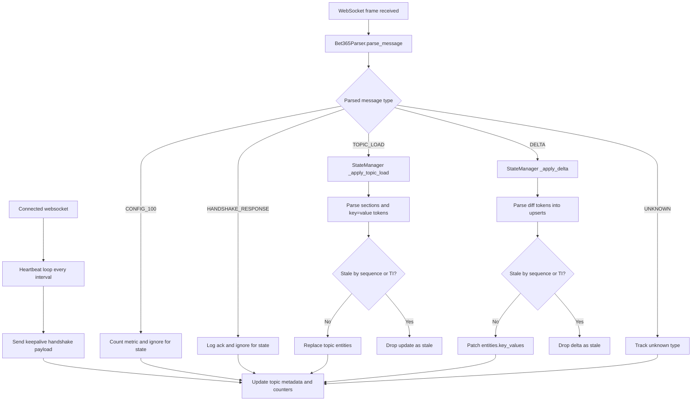
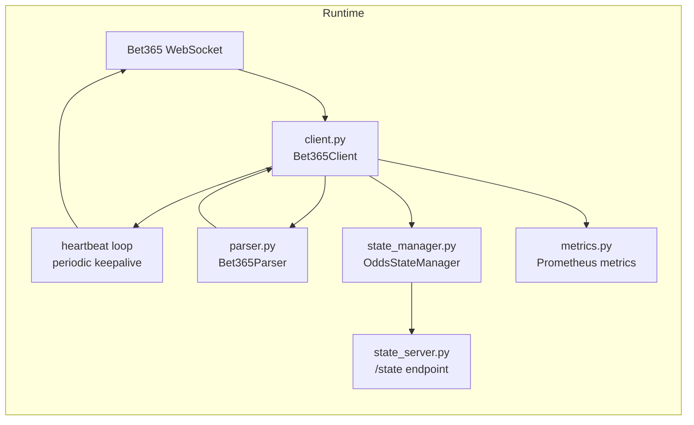

# bet365 Module Guide

This folder contains the core runtime for consuming Bet365 WebSocket messages and turning them into a live in-memory topic state.

If you're new to the protocol, the key idea is:

- `TOPIC_LOAD` gives a full snapshot for a topic (baseline state).
- `DELTA` gives incremental updates for that topic (patches).
- control-plane messages (`CONFIG_100`, handshake responses) are tracked but not applied to topic state.
- a periodic heartbeat keepalive is sent after connect to keep the websocket session active.

## What Message Types Are We Listening To

The parser (`parser.py`) converts raw frame content into one or more structured messages.

| Type | Trigger in raw payload | Meaning | Applied to state? |
|---|---|---|---|
| `CONFIG_100` | payload starts with `100\x02` | Connection/config info from server | No (ignored for topic state) |
| `TOPIC_LOAD` | leading byte `\x14` | Full topic snapshot | Yes (replaces topic snapshot) |
| `DELTA` | leading byte `\x15` | Incremental update | Yes (upserts key/value pairs) |
| `HANDSHAKE_RESPONSE` | leading byte `\x23` | Server handshake/control response | No (ignored for topic state) |
| `UNKNOWN` | anything else | Unrecognized protocol variant | No (counted as unknown) |

## How Messages Are Processed

## Module-by-Module Responsibilities

- `client.py`
    - Owns the websocket lifecycle (connect, listen, reconnect/error counters).
    - Sends the initial handshake built by `Bet365Parser.create_handshake_message(...)`.
    - Runs a periodic heartbeat loop (same keepalive payload) using `Config.HEARTBEAT_INTERVAL_SECONDS`.
    - Parses each frame, emits metrics, and forwards parsed messages to `OddsStateManager.apply_message(...)`.
- `parser.py`
    - Splits concatenated frame payloads (`\x08`) into individual protocol messages.
    - Detects message type (`TOPIC_LOAD`, `DELTA`, etc.) from protocol bytes.
    - Returns normalized dictionaries consumed by the state manager.
- `state_manager.py`
    - Maintains canonical in-memory state per topic in `TopicState`.
    - `TOPIC_LOAD`: parses and **replaces** snapshot entities for the topic.
    - `DELTA`: parses and **upserts** key-values into existing topic snapshot.
    - Drops stale updates using sequence (`SEQ`/`SN`/`SE`) and topic time (`TI`) comparisons.
    - Exposes `snapshot()` and `topic_summaries()` for observability.
- `metrics.py`
    - Defines Prometheus counters/gauges (message totals, topic totals, reconnects, parse errors, connection up/down).
    - Tracks heartbeat send count, heartbeat errors, and last successful heartbeat timestamp.
- `state_server.py`
    - Exposes read-only JSON at `/state` for live internal state inspection.
- `constants.py`
    - Central source of protocol bytes and delimiter constants.
- `config.py`
    - Connection and runtime constants (origin/subprotocol/user-agent/log summary interval).

## State Model (What Gets Stored)

Each topic key maps to a `TopicState` record, containing:

- `entities`: parsed structure with at least `key_values` and section data.
- `raw_payload`: most recent raw snapshot/delta payload for that topic.
- update metadata: `last_update_utc`, `update_count`, `last_message_type`.
- ordering fields: `last_seen_sequence`, `last_seen_topic_ts`.
- quality signals: parse errors, stale-dropped count, and last error reason.

Manager-level counters aggregate behavior across all topics (handled/ignored/unknown/malformed/stale/etc.).

## End-to-End Architecture (Inside This Folder)

## Practical Notes

- A single websocket frame can contain multiple messages, so parser output is always a list.
- Delta parsing currently supports safe `key=value` upserts and preserves unknown tokens for future protocol refinement.
- If a `DELTA` arrives before a `TOPIC_LOAD`, a new topic is created and marked as missing baseline.
- Control-plane events are intentionally ignored for odds state but still visible in logs/metrics.
